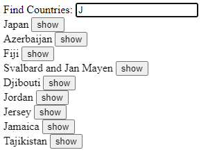
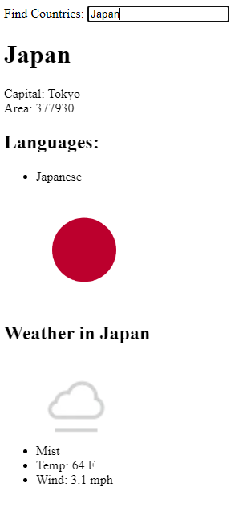
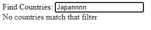

# Data for Countries

This simple app allows users to search data for countries. It uses an API to obtain various data on countries, and then uses a weather API to also generate the current weather in that country.

Filtering is utilized, as well as conditional rendering.

  

  

  

